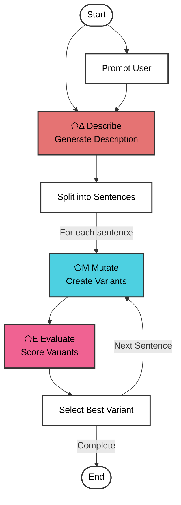

# Text Evolution Pipeline

A multi-stage text evolution system that uses SPOUT's ⬠Δ Describe(Reduce) module for generating descriptions, ⬠Μ Mutate module for generating variations, and ⬠Ε Evaluate module for selecting optimal results. The pipeline progressively evolves text while maintaining semantic consistency and improving quality.

## Process Flowchart



## Process Overview

1. **Initial Input**
   - Takes input text from user prompt or arguments
   - Generates description using ⬠Δ Describe(Reduce) module
   - Prepares text for processing

2. **Text Segmentation**
   - Splits input text into individual sentences
   - Preserves sentence structure and relationships

3. **Variant Creation (⬠Μ Mutate)**
   - Generates multiple variations of each sentence
   - Maintains core meaning and intent
   - Explores alternative expressions

4. **Quality Selection (⬠Ε Evaluate)**
   - Assesses all variants against criteria and description
   - Selects optimal version for each sentence
   - Maintains overall text cohesion

5. **Progressive Saving**
   - Writes content to markdown file as processing occurs
   - Maintains detailed evolution history
   - Preserves intermediate results

6. **Final Composition**
   - Combines best variants into final text
   - Maintains coherence with original context
   - Provides complete evolution record

## SPOUT Modules Used

- **⬠Δ Reduce**: Generates descriptive context for the input text to guide evaluation
- **⬠Μ Mutate**: Creates variations of text segments while maintaining core meaning and intent
- **⬠Ε Evaluate**: Assesses variants and selects optimal versions based on specified criteria and context

## Configuration Options

```javascript
{
  input: string,        // Text to evolve (default: user will be prompted)
  criteria: string,     // Evaluation criteria (default: "quality, interesting, creative, coherent")
  variants: number,     // Variants per sentence (default: 5)
  mutation: number,     // Mutation level (default: 1)
  description: string   // Optional custom description
}
```

## Usage Examples

### Basic Evolution
```bash
./text_evolve_pipeline.mjs --input "The cat sat on the mat."
```
- Uses default criteria and settings
- Generates variants with standard mutation

### Custom Criteria
```bash
./text_evolve_pipeline.mjs --criteria "quality,creativity" --variants 3
```
- Specifies custom evaluation criteria
- Adjusts number of variants

### Advanced Evolution
```bash
./text_evolve_pipeline.mjs --input "Long text..." --mutation 2
```
- Increases mutation level for more variation
- Processes longer input text

### Complex Configuration
```bash
./text_evolve_pipeline.mjs --input "Some text" --criteria "humor,engagement" --variants 8 --mutation 3
```
- Multiple custom settings
- Maximum variation and evaluation

## Output Format

- Files created in `../output/text_evolve_pipeline_output/`
- Named with timestamp: `evolution_YYYYMMDDHHMMSS.md`
- Markdown format with sections:
  - Original text
  - Generated description
  - Sentence-by-sentence evolution
  - Final evolved text

## Dependencies

- **SPOUT CLI**: Required for text processing modules
- **zx**: Used for shell operations and file handling
- **Node.js**: Runtime environment

## Error Handling

- Sanitizes input text to prevent command errors
- Preserves progress through progressive saving
- Provides detailed error logging
- Ensures partial results are saved

## Use Cases

1. **Text Improvement**
   - Content enhancement
   - Style refinement
   - Coherence maintenance

2. **Creative Writing**
   - Story evolution
   - Sentence variation
   - Style experimentation

3. **Content Optimization**
   - Message clarity
   - Engagement improvement
   - Theme consistency

4. **Educational Tools**
   - Writing assistance
   - Style analysis
   - Text transformation examples
