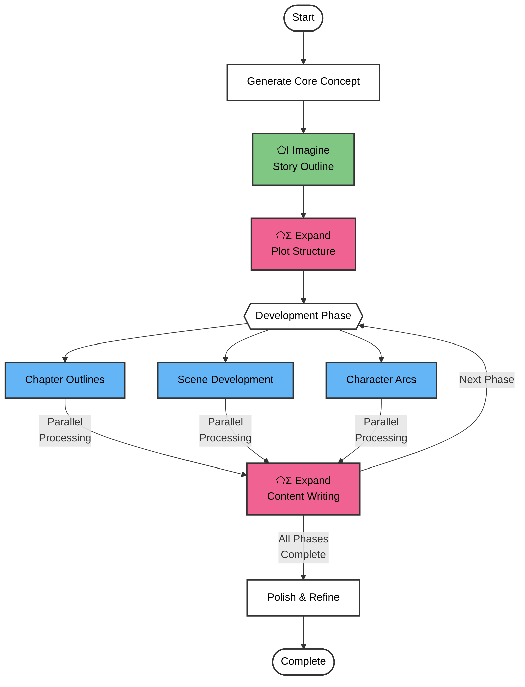

# Book Writer Pipeline
A multi-phase novel generation system using SPOUT's ⬠Σ Expand (develop), ⬠I Imagine (outline), and other modules to create a complete novel from concept to final draft. The pipeline generates a detailed outline, develops plot structures, and progressively expands content into a complete manuscript.



## Process Overview

1. **Initial Setup**
   - Loads configuration (genre, length, style)
   - Creates project structure
   - Generates core concept using ⬠I Imagine

2. **Outline Generation**
   - Creates high-level story outline
   - Develops major plot points
   - Establishes character arcs
   - Generates story structure using ⬠I Imagine

3. **Content Development Phases**
   - Chapter Development
     - Detailed chapter outlines
     - Scene breakdowns
     - Character development
   - Content Expansion
     - Scene writing using ⬠Σ Expand
     - Character dialogue and interactions
     - Setting descriptions
   - Refinement
     - Consistency checks
     - Style enhancement
     - Narrative flow improvement

## SPOUT Modules Used

- **⬠I Imagine**: Creates story outlines and plot structures
- **⬠Σ Expand**: Develops content and expands scenes
- **⬠Γ Generate**: Assists with dialogue and description generation
- **⬠Λ Analyze**: Reviews content for consistency and quality

## Configuration Options

```javascript
{
  genre: "fantasy",     // Target genre (default: undefined)
  length: "novel",      // short_story, novella, novel (default: "novel")
  style: "descriptive", // writing style preference
  threads: 4,          // Number of parallel processing threads (default: 2)
  outline: undefined   // Optional custom outline file
}
```

## Usage Examples

### Basic Novel Generation
```bash
./book_writer.mjs
```
- Generates complete novel with random genre
- Uses default settings

### Genre-Specific Generation
```bash
./book_writer.mjs --genre "science_fiction" --style "technical"
```
- Creates sci-fi novel with technical writing style

### Custom Outline
```bash
./book_writer.mjs --outline "my_outline.md" --threads 6
```
- Uses provided outline
- Parallel processing with 6 threads

## Output Structure

- Creates project in `../output/book_writer_output/[timestamp]/`
- Directory structure:
  ```
  book_writer_output/
  ├── outline/
  │   ├── concept.md
  │   ├── structure.md
  │   └── chapter_outlines/
  ├── drafts/
  │   ├── chapters/
  │   └── scenes/
  └── final/
      └── novel.md
  ```

## Dependencies

- **SPOUT CLI**: Required for all text generation
- **zx**: Shell operations and file handling
- **Node.js**: Runtime environment

## Error Handling

- Saves progress at each phase
- Allows restart from last successful phase
- Maintains backups of generated content
- Provides detailed error logging

## Use Cases

1. **Novel Writing**
   - Complete novel generation
   - Story outline creation
   - Plot development

2. **Writing Assistance**
   - Scene expansion
   - Character development
   - Plot structure generation

3. **Educational**
   - Story structure learning
   - Writing process demonstration
   - Creative writing examples

4. **Content Creation**
   - Multiple genre support
   - Customizable style and tone
   - Scalable content generation
