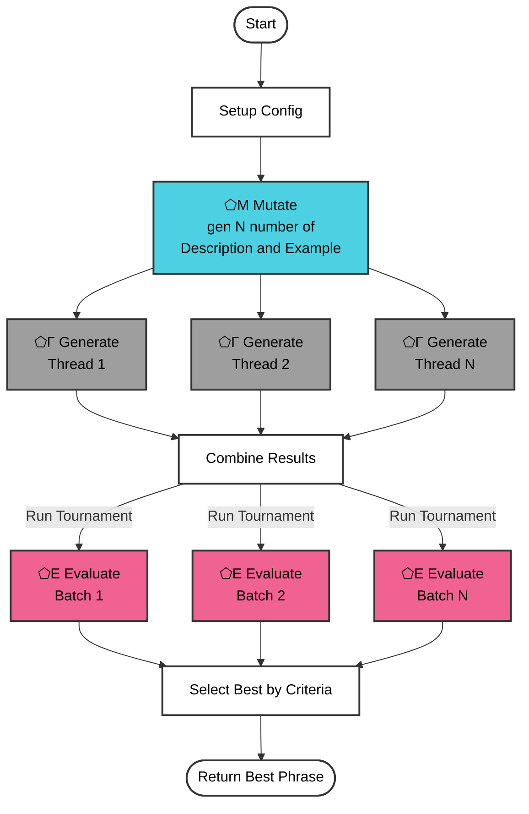

# Phrase Factory

A multi-threaded phrase generation and evaluation pipeline using SPOUT's ⬠Μ Mutate, ⬠Γ Generate, and ⬠Ε Evaluate modules. The factory creates variations of input descriptions and examples, generates phrases in parallel, then runs a tournament-style evaluation to select the best results.

## Process Flowchart



## Process Overview

1. **Configuration Setup**
   - Loads default settings and merges with command-line arguments
   - Creates output directory for results

2. **Variant Generation (⬠Μ Mutate)**
   - Takes base description and example
   - Creates N variants using SPOUT's mutate module
   - Each variant maintains core meaning while exploring alternatives

3. **Parallel Generation (⬠Γ Generate)**
   - Spawns N parallel threads (one per variant)
   - Each thread generates unique phrases
   - Automatically removes duplicates
   - Tracks progress and saves intermediate results

4. **Tournament Evaluation (⬠Ε Evaluate)**
   - Evaluates generated phrases in tournament style
   - Compares phrases in small batches
   - Advances winners through elimination rounds
   - Produces detailed evaluation results

## SPOUT Modules Used

- **⬠Μ Mutate**: Creates variations of input text while preserving core meaning
- **⬠Γ Generate**: Produces new phrases based on descriptions and examples
- **⬠Ε Evaluate**: Judges phrases based on specified criteria

## Configuration Options

Default settings:
```javascript
{
  maxItems: 30,          // Maximum items per variant
  batchSize: 5,          // Items per generation batch
  numVariants: 6,        // Number of parallel threads
  maxThreads: 3,         // Maximum concurrent threads
  tournamentBatchSize: 4,// Items per tournament batch
  evaluationCriteria: "originality, coolness, appropriateness"
}
```

## Usage Examples

### Quick Test Run
```bash
npm run phrase:quick
```
- 2 variants, 10 items max, 2 threads
- Good for testing and quick iterations

### Marketing Focus
```bash
npm run phrase:marketing
```
- 4 variants, 40 items
- Evaluates based on "marketing appeal, memorability, brand alignment"

### Creative Exploration
```bash
npm run phrase:creative
```
- 4 variants, 40 items
- Judges on "creativity, uniqueness, innovation"

### Full Production
```bash
npm run phrase:full
```
- 6 variants, 50 items per variant
- Maximum parallel processing

### Safe Mode
```bash
npm run phrase:safe
```
- 2 variants, 20 items
- Smaller batches for more stable processing

## Output Files

- `phrase_factory_results.txt`: All unique generated phrases
- `phrase_factory_variant_N.txt`: Results from each variant thread
- `tournament_results.txt`: Detailed evaluation results and winner selection

## Example Use Cases

1. **Product Naming**
   - Generate variations of product names
   - Evaluate based on marketability and brand fit

2. **Marketing Taglines**
   - Create multiple marketing phrases
   - Judge based on appeal and memorability

3. **Brand Messages**
   - Generate brand-aligned messaging
   - Evaluate for consistency and impact

4. **Creative Writing**
   - Generate creative variations
   - Select based on originality and style
