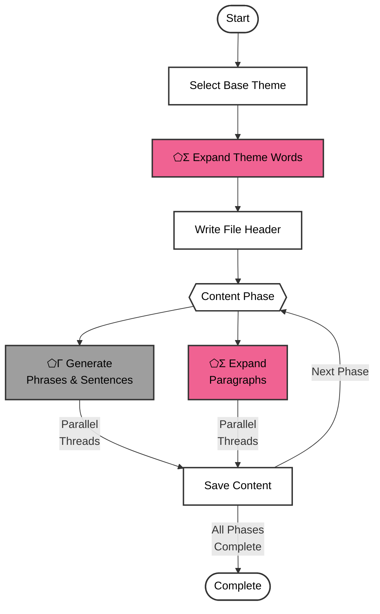

# Test Text Factory
A multi-threaded test content generation system using SPOUT's ⬠Γ Generate and ⬠Σ Expand modules. The factory creates varied test content based on themes, generates content in parallel threads, and progressively saves content from phrases to multi-paragraph texts.



## Process Overview

1. **Configuration Setup**
   - Loads command-line arguments (threads, theme)
   - Creates output directory for results
   - Selects base theme (custom or random)

2. **Theme Processing**
   - Expands base theme into related words using ⬠Σ Expand
   - Creates theme word pool for content generation
   - Writes file header with theme information

3. **Content Generation Phases**
   - Uses parallel threads for each phase
   - Phrases/Sentences: ⬠Γ Generate
     - Short phrases (3-7 words)
     - Medium sentences (10-15 words)
     - Complex sentences (15-25 words)
   - Paragraphs: ⬠Σ Expand
     - Short paragraphs (2-3 sentences)
     - Medium paragraphs (4-6 sentences)
     - Long paragraphs (6-8 sentences)
     - Multi-paragraph content (4-5 paragraphs)
     - Extra-long content (6-8 paragraphs)

## SPOUT Modules Used

- **⬠Γ Generate**: Creates phrases and sentences with controlled length and complexity
- **⬠Σ Expand**: Used for theme expansion and paragraph generation

## Configuration Options

```javascript
{
  threads: 1,           // Number of concurrent generation threads (default: 1, max: 8)
  theme: undefined      // Custom theme word (default: random from predefined list)
}
```

## Usage Examples

### Single Thread (Default)
```bash
./testscriptfactory.mjs
```
- Sequential processing with random theme
- Good for testing and debugging

### Custom Theme
```bash
./testscriptfactory.mjs --theme "cyberpunk"
```
- Uses specified theme word
- Generates related theme variations

### Multi-threaded with Theme
```bash
./testscriptfactory.mjs --threads 4 --theme "meditation"
```
- Parallel processing with 4 threads
- Custom theme-based content

### Maximum Performance
```bash
./testscriptfactory.mjs --threads 8
```
- Maximum parallel processing
- Random theme selection

## Output Format

- Files are created in `../output/text_factory_output/`
- Named with timestamp: `test-text_YYYYMMDDHHMMSS.txt`
- Includes base theme information in header
- Content sections are clearly separated by newlines
- Progressive saving ensures content preservation

## Dependencies

- **SPOUT CLI**: Required for text generation and theme expansion
- **zx**: Used for shell operations and file handling
- **Node.js**: Runtime environment

## Error Handling

- Catches and logs generation errors
- Preserves generated content even if later sections fail
- Provides detailed error messages for troubleshooting
- Ensures partial results are always saved

## Use Cases

1. **Testing Text Editors**
   - Various content lengths and complexities
   - Mixed formatting and structure

2. **Performance Testing**
   - Large text file generation
   - Multi-threaded processing tests

3. **Content Generation**
   - Theme-based content creation
   - Sample content for demonstrations
   - Test data for applications

4. **Load Testing**
   - Database content population
   - Application stress testing
